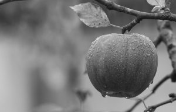

# VQ Compress

## Vector Quantization Image Compression & Decompression

### Overview 
This project demonstrates how to compress and decompress a grayscale image using Vector Quantization (VQ). The main goal is to reduce image size by converting small blocks (tiles) of pixels into codebook indices and reconstructing the image using that codebook.


### 📁 File Structure
 ```bash
VQCompress/
├── vectorQuantizationCompress.java   # Compresses image and generates Compressed.txt
├── vectorQuantizationDecompress.java # Decompresses Compressed.txt and reconstructs the image
├── Compressed.txt                    # Output from compression, input to decompression
├── OriginalImage.png                 # Your original grayscale image (input for compression)
├── DecompressedImage.png             # Final output after decompression
```


### 🔧 Prerequisites
Java 8 or later installed

Grayscale image file 

Basic terminal or IDE like IntelliJ, VS Code


### 🔁 Flow of Execution
#### 1. 📦 Compression (vectorQuantizationCompress.java)
Input: OriginalImage.png

Process:

Load image

Divide into tiles (e.g., 8×8 pixels)

Create a codebook by grouping similar tiles

Replace each tile with its codebook index

Store metadata, tile indices, and codebook vectors in Compressed.txt

Output: Compressed.txt

#### 2. 🧩 Decompression (vectorQuantizationDecompress.java)
Input: Compressed.txt

Process:

Read metadata (image dimensions, tile size, codebook size)

Reconstruct tiles using codebook

Stitch tiles into a full image

Save final output as DecompressedImage.png

Output: DecompressedImage.png


### ▶️ How to Run
#### Compile Java files:
```bash 
javac vectorQuantizationCompress.java
javac vectorQuantizationDecompress.java
```

#### Run compression:
```bash 
java vectorQuantizationCompress
```
Produces Compressed.txt

#### Run decompression:
```bash 
java vectorQuantizationDecompress
```
Produces DecompressedImage.png


### 🧪 Example Compressed.txt Format
```bash
300 192 8 256           # imageWidth imageHeight tileSize codebookSize
0 1 1 2 3 4 5...        # tile indices (tilesPerRow × tilesPerCol)
...                     # more index rows
12 45 67 ...            # codebook vector 0 (tileSize × tileSize values)
...                     # codebook vector 1
...
```

### 📊 Quality Check
You can compare OriginalImage.png with DecompressedImage.png

Optionally compute PSNR (Peak Signal-to-Noise Ratio) for quality assessment


### Project Demo
#### Original Image


#### Running compression code 
```bash
sandesh@sandesh-Inspiron-3558:~/VQCompress$ java vectorQuantizationCompress 
Give file path : fruit.jpeg
Select compression quality option: 
1. Low Compression (High Quality)
2. Medium Compression (Medium Quality)
3. High Compression (Low Quality)
1
Image loaded and split into 24 x 37 tiles.
Compression successful. Data saved to Compressed.txt
```

#### compressed file 
```bash
300 192 8 16
0 1 2 3 4 5 6 11 7 8 10 11 11 13 10 11 13 13 11 2 1 1 0 8 10 3 4 1 1 1 1 14 15 15 15 8 3 
4 5 5 4 4 5 6 8 9 9 10 11 12 13 14 15 15 15 12 15 13 2 1 0 0 8 2 2 1 1 1 1 6 15 12 10 3 
1 4 5 3 1 4 4 5 5 5 10 12 12 13 11 12 12 15 15 15 15 15 2 3 3 1 1 0 8 10 2 2 6 10 12 5 1 
1 1 1 1 1 4 4 4 5 9 10 12 12 11 11 12 12 12 15 15 12 15 12 1 1 1 1 3 1 0 0 0 0 0 0 0 0 
1 1 1 1 4 5 4 4 5 6 10 12 12 12 12 15 15 12 15 15 12 12 12 3 4 3 4 4 5 1 2 3 3 2 2 3 1 
3 1 1 5 6 8 2 4 5 10 11 11 12 12 15 15 12 8 7 12 12 7 7 8 6 9 5 0 1 5 6 9 5 9 7 0 4 
9 5 5 9 10 13 9 9 10 11 12 12 12 12 15 12 12 8 5 5 5 5 5 5 9 9 1 1 10 11 12 12 11 13 6 14 11 
12 11 11 11 11 11 13 10 11 12 12 12 12 12 12 12 12 12 13 10 11 15 15 15 15 15 15 15 15 15 15 12 12 12 0 9 12 
15 15 15 12 12 12 11 11 12 12 12 12 12 12 12 12 12 12 12 12 15 15 15 15 15 15 15 15 15 15 15 15 12 0 1 5 11 
15 15 15 15 12 12 12 12 12 12 12 12 12 12 13 11 12 12 12 15 15 15 15 12 15 15 12 12 12 12 12 12 15 1 11 5 9 
15 15 15 15 15 15 12 12 12 12 11 12 12 12 13 10 12 12 15 15 15 12 12 12 12 12 12 12 12 13 11 12 12 15 15 13 2 
15 15 15 15 15 15 15 15 12 12 12 12 12 12 12 11 12 12 15 12 12 12 12 11 11 11 13 11 13 8 10 11 10 15 15 15 5 
15 15 15 15 15 15 15 15 15 15 15 15 12 12 12 12 12 15 12 13 13 12 7 8 9 6 8 9 9 5 5 5 9 14 15 15 9 
15 15 15 15 15 15 15 15 12 15 15 15 15 12 12 11 12 15 12 8 9 8 5 5 5 5 4 5 5 4 4 5 5 14 15 15 12 
15 15 15 15 15 15 12 12 12 12 15 15 15 12 13 8 14 15 13 5 4 5 3 0 1 1 3 1 1 1 1 4 4 15 15 15 12 
15 15 15 15 15 15 12 13 11 12 15 15 15 12 13 5 6 12 8 4 1 4 0 1 1 1 1 1 1 1 1 0 1 15 15 15 13 
15 15 15 15 15 15 12 13 10 12 15 15 15 15 13 5 6 15 15 3 1 1 1 1 1 1 1 1 1 1 1 1 1 15 15 0 1 
15 15 15 15 15 15 12 7 9 14 15 15 15 15 13 5 6 15 15 13 1 1 1 1 1 1 1 1 1 1 1 1 14 12 0 15 12 
15 15 15 15 15 15 12 8 9 6 12 15 15 12 13 9 14 15 15 15 3 1 1 1 1 1 1 1 1 1 1 6 12 1 15 15 15 
15 15 15 15 15 15 12 8 5 9 10 12 12 12 13 8 8 7 12 15 15 3 1 1 1 1 1 1 1 1 2 15 8 15 15 15 15 
15 15 15 15 15 15 12 8 5 9 10 11 12 12 12 11 8 1 10 15 15 15 10 2 1 1 1 1 1 15 15 12 15 15 15 15 0 
15 15 15 15 15 15 12 8 5 9 10 11 12 12 12 12 12 9 15 15 15 15 15 15 15 15 15 15 15 7 12 15 15 15 15 12 0 
15 15 15 15 15 15 12 13 10 11 12 12 12 12 12 12 12 12 15 15 15 15 15 15 15 15 15 15 12 15 15 15 12 7 11 15 15 
15 15 15 15 15 15 12 12 12 12 15 15 15 12 12 12 12 12 15 15 15 15 15 15 15 15 15 7 15 15 15 8 1 15 15 15 15 
106 106 108 108 102 94 86 83 109 107 103 98 91 83 78 77 102 98 92 86 79 74 71 72 87 85 81 78 73 69 66 67 74 72 71 70 66 62 61 61 60 58 58 57 57 57 59 62 52 50 51 53 56 60 66 72 54 54 55 58 63 68 75 80 
77 76 73 72 71 71 69 68 72 71 70 69 69 68 67 66 70 68 66 65 64 64 64 64 67 65 63 62 63 66 69 71 61 62 64 67 71 77 81 85 65 68 74 79 83 87 89 90 76 79 83 87 89 89 90 90 82 84 86 87 88 89 90 92 
67 69 74 77 74 69 65 65 65 66 68 69 67 65 64 66 68 69 71 74 74 75 78 81 78 80 83 87 89 90 91 92 87 89 91 92 93 92 91 90 91 92 92 91 90 91 90 89 91 92 92 90 91 92 92 91 90 92 92 91 90 91 89 87 
64 64 64 63 62 61 61 62 66 67 68 68 68 69 71 72 83 83 83 83 82 82 83 83 90 89 88 86 84 83 82 82 88 86 85 84 82 81 81 80 89 88 86 84 83 82 81 80 88 87 84 82 80 79 77 75 88 86 84 83 82 81 79 78 
62 63 63 65 67 70 73 75 76 77 78 80 82 83 84 85 83 84 86 88 89 89 89 88 81 82 84 86 87 87 86 85 81 82 84 85 87 87 87 87 80 81 83 84 86 87 88 88 77 78 80 82 84 85 85 85 77 78 80 82 84 85 84 84 
76 77 79 82 85 88 90 92 85 85 86 88 90 92 94 95 89 90 90 90 92 94 96 97 88 87 88 89 90 93 95 97 86 87 87 88 90 92 95 96 86 86 87 87 88 91 92 93 85 85 86 86 87 89 90 91 84 84 85 87 88 90 91 91 
97 98 101 102 104 107 109 110 98 99 101 104 105 107 109 110 98 100 102 105 106 108 110 111 99 101 103 105 107 108 109 111 98 100 103 105 106 108 109 109 97 99 101 103 105 105 106 107 95 97 100 102 103 104 104 105 94 96 99 101 102 102 103 104 
112 113 113 113 114 114 114 114 112 112 112 113 113 113 113 113 110 110 111 111 112 111 111 112 110 110 111 111 111 111 111 110 109 110 110 111 110 110 109 109 108 108 109 109 109 109 107 107 105 106 107 107 107 106 105 104 104 104 105 105 105 104 102 101 
113 112 110 108 106 105 104 104 112 111 109 108 106 105 104 103 110 109 108 106 105 104 103 102 108 107 106 105 104 102 101 101 105 105 104 103 102 101 100 99 103 103 103 102 100 99 98 98 102 102 101 100 99 98 97 96 101 101 101 100 99 98 96 96 
103 104 104 103 103 103 104 104 103 103 103 102 102 102 103 104 102 102 101 100 100 101 102 104 101 101 100 99 99 100 102 104 99 99 99 98 98 100 102 104 98 98 98 98 98 99 101 103 96 96 97 97 98 99 100 102 94 95 96 97 97 98 99 101 
107 108 109 110 111 112 112 113 107 108 109 110 111 112 112 113 107 107 109 110 112 112 113 113 106 107 109 110 112 113 114 114 106 107 109 111 113 114 114 114 105 107 109 111 113 115 115 115 105 106 109 112 114 115 116 115 105 106 109 112 114 115 116 116 
113 114 114 114 113 114 115 116 114 114 115 115 115 115 116 117 115 115 116 116 116 116 117 118 115 116 116 117 117 117 118 119 115 116 117 117 117 118 119 121 116 117 117 118 118 119 120 121 117 117 119 119 119 120 122 123 118 119 119 120 120 121 123 124 
118 120 121 122 121 120 119 119 119 121 122 123 122 121 120 119 121 122 124 125 124 122 121 121 123 124 126 127 125 124 123 122 125 126 128 128 127 125 123 123 125 127 128 128 127 125 124 123 126 127 129 129 127 125 124 123 126 127 129 128 127 125 124 123 
116 115 114 112 111 110 109 109 117 116 114 112 111 110 109 109 118 117 115 113 111 110 110 110 119 117 115 113 111 110 111 111 119 118 115 113 111 111 111 112 120 118 115 112 111 111 112 112 120 118 114 112 110 110 111 112 120 118 114 112 110 110 111 112 
108 110 111 111 111 113 114 114 113 111 109 110 112 112 111 110 113 111 110 113 115 116 120 125 110 110 113 116 115 118 130 144 111 112 114 115 114 114 124 136 113 112 112 115 115 114 115 118 113 112 112 115 117 118 116 114 112 115 116 115 115 118 119 119 
114 113 114 117 119 119 120 122 114 114 115 115 113 116 125 133 113 115 118 121 122 129 142 153 143 143 143 142 142 146 153 158 154 158 160 158 154 152 153 156 129 144 160 167 164 160 157 157 119 134 151 162 166 165 162 158 118 120 125 134 149 160 163 162 
```

#### Decompressed image

